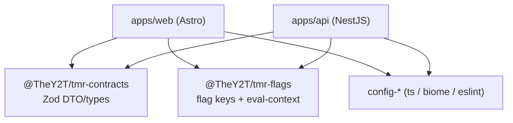
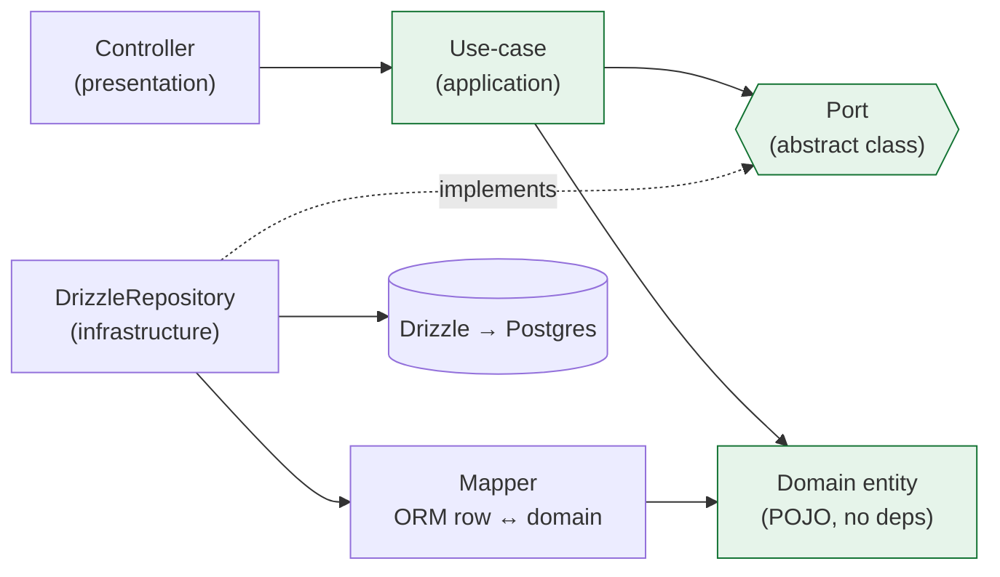

# Software / code architecture

## Monorepo dependency graph

Internal packages are scoped `@TheY2T/tmr-*` and compile to **CommonJS** so both NestJS (CJS) and
Astro (ESM) consume them. Turbo `^build` builds them before the apps.

## Backend — hexagonal (inward dependencies only)

**Rule:** `domain ← application ← infrastructure/presentation`. Only `infrastructure/` imports
Drizzle; swap the adapter binding in the feature module to change persistence. Reference:
`apps/api/src/health/`.

### Feature modules (Phase 1)

Each is a hexagonal slice under `apps/api/src/`; ports are named for the capability (ADR 0012),
adapters for the technology.

| Module | Ports (capability) | Adapters (technology) |
|---|---|---|
| `health/` | `DatastoreHealthCheck` | `DrizzleDatastoreHealthCheck` |
| `catalogue/` | `ContentRepository`, `CatalogueSearch`, `MediaLibrary` | `DrizzleContentRepository`, `MeilisearchCatalogueSearch`, `S3MediaLibrary` |
| `auth/` | `CurrentUser` | `BetterAuthCurrentUser` (+ Better Auth guard/RBAC) |
| `authoring/` | `ContentAuthoring`, `TaxonomyCatalog` | `DrizzleContentAuthoring`, `DrizzleTaxonomyCatalog` |
| `favorites/` | `FavoritesRepository` | `DrizzleFavoritesRepository` |
| `collections/` | `CollectionRepository` | `DrizzleCollectionRepository` |
| `progress/` | `ProgressRepository` | `DrizzleProgressRepository` |
| `help/` | `HelpTopicRepository` | `DrizzleHelpTopicRepository` |
| `reviews/` | `ReviewRepository` | `DrizzleReviewRepository` (SM-2 domain fn) |

Cross-feature reuse is via module imports (e.g. `authoring`/`favorites` import `CatalogueModule` for
`ContentRepository`/`MediaLibrary`/`CatalogueReindexService`, and `auth` for `CurrentUser`) — never by
reaching into another feature's infrastructure.

## Frontend — islands

Static layout in `.astro`; interactivity in `.tsx` island roots hydrated with `client:*`. Flags are
evaluated in SSR middleware and passed into islands as props (first paint matches server). See
`apps/web/CLAUDE.md`.
