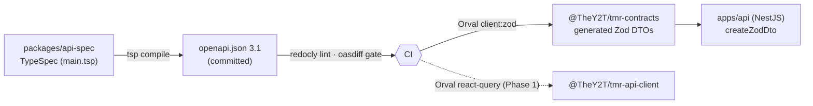
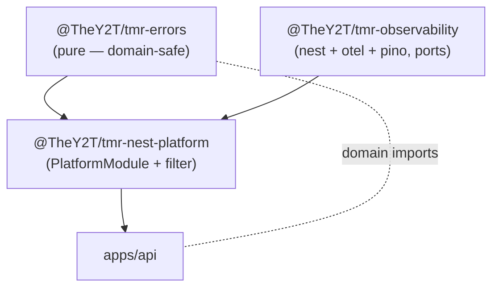
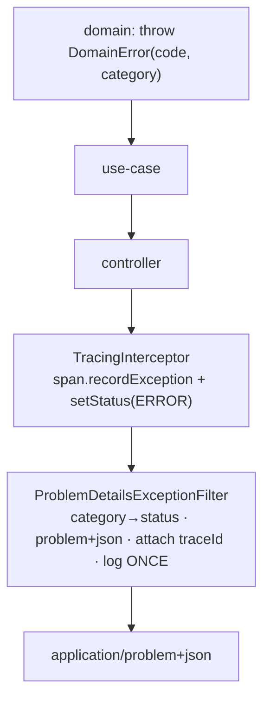
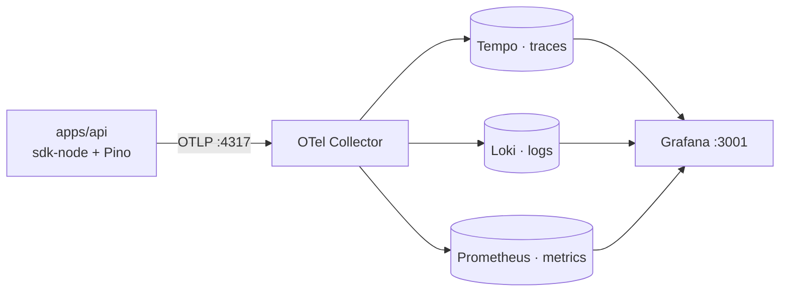

# Platform architecture (spec-first · errors · observability)

Cross-cutting foundation every backend feature builds on. See ADRs 0006–0009.

## Spec-first API pipeline

Paths live only in TypeSpec. `pnpm spec:generate` recompiles + regenerates; CI fails on drift.

## Package dependency layering

## Request error flow (record-once)

## Observability data flow

`pnpm obs:up` starts the stack. Every Pino log inside a span carries `trace_id`/`span_id`; the same
`traceId` appears in problem+json error bodies — one id across error → span → log.
