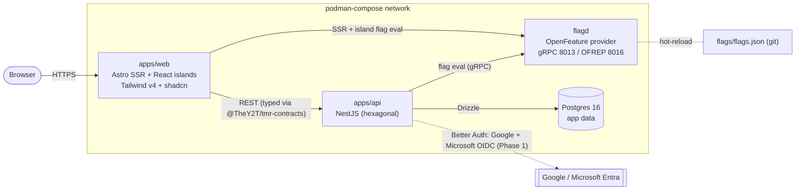

# System architecture

Deployment topology and request/data flow. Runs as a single podman-compose stack.

## Services

| Service | Tech | Ports | Notes |
|---|---|---|---|
| `web` | Astro SSR (`@astrojs/node`) | 4321 | React islands; evaluates flags in middleware per request |
| `api` | NestJS | 3000 | Hexagonal; `GET /health`, flag-gated demo routes |
| `flagd` | OpenFeature flag daemon | 8013 (gRPC), 8016 (OFREP) | Flags from `flags/flags.json`, no DB/UI |
| `db` | Postgres 16 | 5432 | App data via Drizzle; healthchecked |

Auth (Phase 1) uses Better Auth with Google + Microsoft/Entra OIDC and session cookies.
